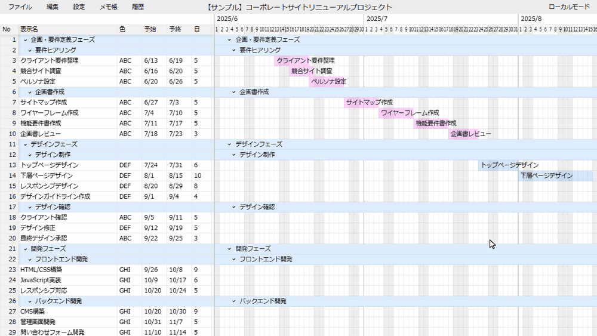

# Excel-like Gantt Chart App

[](https://github.com/kloir-z/ganttapp-local/actions/workflows/ci.yml)
[](https://github.com/kloir-z/ganttapp-local/actions/workflows/deploy.yml)
[](https://codecov.io/gh/kloir-z/ganttapp-local)
[](LICENSE)


English | [日本語](README.md)

A Gantt chart app that runs entirely in the browser, with nothing to install. It gives you Excel-like table editing and intuitive chart editing with the mouse.

It doesn't just lay out a schedule — it recalculates dependencies ("start 3 days after the previous task," and so on) automatically, skipping weekends and holidays. You can redefine which days count as holidays, and toggle holiday-avoidance on or off per row. It stays responsive even at several hundred to 1000 rows, so it handles the kind of large plans that became too heavy to manage in Excel.

I originally built it for my own use, but I'm publishing it in case it helps others with the same frustrations.



## Try It Out

**[https://kloir-z.github.io/ganttapp-local/](https://kloir-z.github.io/ganttapp-local/)**

(Open it in Chrome / Edge / Firefox. See [System Requirements](#system-requirements) for details.)

## Data Handling & Privacy

**Your project data never leaves your machine.** There are no accounts, no telemetry, and the only place data is persisted is in files you download yourself (ZIP / HTML).

This is verifiable, not just a promise:

- The Content-Security-Policy embedded in the served HTML contains **no external domains**, so the **browser itself blocks** any attempt to send data out
- Keep the DevTools Network tab open while you work — zero external requests after load
- Everything works in airplane mode / offline (`file://`)
- Deployment runs on GitHub Actions, so you can confirm from the public build logs that the served code matches this repository

See [SECURITY.md](SECURITY.md) for the full verification guide, the complete list of network requests, and how to report vulnerabilities. If your workplace policy is strict, you can also build from source yourself (`npm run build:singlefile`).

## Key Features and Points

### Complete Table-Chart Integration
- Editing the table instantly reflects in the chart
- Dragging the chart automatically updates the table
- **Double-click to create chart**, **drag to move/adjust**, **right-click to delete**

### Excel-like Table Operations
- Cell editing, row insertion/deletion/copying
- Row movement by dragging
- Hierarchical structure for task grouping

### Automatic Dependency Calculation (after and sameas)
- **`after,-x,n`**: Start n days after completion of x rows above
  - Example: `after,-1,3` → Set start date 3 days after 1 row above
- **`sameas,-x`**: Start at the same time as x rows above
  - Example: `sameas,-1` → Match start date of 1 row above
- Real-time updates when any dependency relationship changes

### Automatic Adjustment Considering Holidays
- Automatically avoid weekends/holidays when changing dates (can be enabled/disabled per row)
- Customizable holiday settings (weekend days/colors, holiday colors, custom holidays)
- ※Japanese holidays from 2022-2029 are pre-configured by default

### Chart Overview Capability
- **Chart daily width adjustable in 0.5px increments** - Supports overview display of long-term projects
- Displays up to 1000 tasks smoothly

### Notes
- **Notebook (tree-based)**: Hierarchical rich-text (Quill) notes
- **Row notes**: Attach a note to any Gantt chart row. A sticky-note icon appears
  when you hover a row; click it to edit in an in-place popover (draggable and
  resizable). Row notes can also be reviewed and edited from the "Task Notes"
  list in the notebook

### Other Features
- **Undo/Redo**: Maintains up to 30 operation history
- **Multi-language Support**: Japanese and English support
- **Date Format Options**: Choose from yyyy/mm/dd, mm/dd/yyyy, or dd/mm/yyyy formats

## Basic Usage

### Creating a New Project
1. Start a project with "File" → "New"
2. Add and edit tasks in the WBS table
3. Set task relationships in the dependency column
4. Adjust periods in the Gantt chart

### Saving and Loading Projects
- **Save**: Use "File" → "Download Project ZIP" to save as a ZIP file (contains the project plus its notes)
- **Load**: Use "File" → "Upload Project ZIP" to open a saved file
- This ZIP is the only "real" save format you can re-edit. The exports below (PDF / Excel / standalone HTML) are output for distribution/viewing — you cannot load a PDF or Excel file back into the app.

### Export (PDF / Excel / Standalone HTML)
The "File" → "Export" submenu writes the chart in three formats depending on your need.

- **PDF**: Rasterizes the whole chart as an image and writes it to PDF (virtualization is disabled so every row and date fits on the page). Good for printing or non-editable handouts.
- **Excel (view-only)**: Reproduces the on-screen appearance as an `.xlsx`. **It is not a feature-equivalent of the app — it only "displays" the chart in Excel.** Specifically:
  - The left side holds the WBS table (visible columns), and the right side is a one-column-per-day chart. The on-screen `No` column is omitted (Excel's own row numbers replace it); instead an always-on column carrying a mechanical hierarchical WBS number like `1` / `1-1` / `1-1-1` is written up front, and task names are indented to their WBS depth.
  - Planned/actual bars, weekend/holiday shading, separator bands, the faint per-day vertical lines, and the darker month-start line are reproduced as static visuals.
  - However, there is **no dependency calculation, holiday avoidance, or drag editing** — none of the dynamic behavior. Cell colors are baked in statically; moving a date does not move the bars. It is purely a snapshot to open and look at (or print) in Excel.
- **Standalone HTML**: Writes a single HTML file with the app and the current data baked in.
  - **Pros**: The recipient just double-clicks it to see the finished Gantt chart. No server required, and unlike PDF/Excel the **dynamic features stay alive** — scrolling, editing, and viewing notes all work. Ideal for letting colleagues try the app without installing anything.
  - **Caveats**:
    - Edits made in the opened copy are not saved back into the file itself. To keep changes, export again as ZIP or standalone HTML.
    - The data is embedded as plain JSON inside the HTML, so be aware the contents are readable when you distribute it.
  - Note (for developers): files exported from the live site or the single-file build (`build:singlefile`) open directly via `file://`. The only exception is a file exported from the dev server `npm run dev` — it loads JS as external modules (`type="module"`), which browsers block over `file://`. This is irrelevant for normal use.

### Using Notes
- **Notebook (tree-based)**:
  1. Open the notes screen with the "Notes" button
  2. Select an item in the left tree
  3. Record notes in the right editor
- **Row notes**:
  1. Hover a Gantt chart row to reveal the sticky-note icon on the left
  2. Click it to open a popover and record that row's note in rich text
     (drag the header to move, drag the bottom-right corner to resize)
  3. The notebook's "Task Notes" list shows every row note with its row number
     and task name for quick review and editing

## Why I Created This

I was creating Gantt charts in Excel using conditional formatting and formulas, but when the number of rows increased (200+ rows), updates became cumbersome and felt like a typical example of "wrong way to use Excel." The performance was slow and lacked good overview capability.

When ChatGPT emerged in 2023, I learned about its high code generation capabilities and thought "maybe I can create a Gantt chart app?" This was the catalyst for starting development.

## System Requirements

**Works on modern PC browsers (Chrome / Edge / Firefox).**

- Not verified on Safari
- Cannot be used on mobile devices (no support planned)

---

## For Developers

### Setup

Prerequisites:
- Node.js 16+
- npm or yarn

```bash
# Clone the repository
git clone https://github.com/kloir-z/ganttapp-local.git
cd ganttapp-local

# Install dependencies
npm install

# Start the development server (http://localhost:5173)
npm run dev
```

### Build & Distribution

```bash
npm run build      # Production build (output to dist/ folder)
```

#### Single-File Build (offline distribution)
```bash
npm run build:singlefile   # Inline all assets into one file (dist-single/index.html)
```
- JS / CSS / holiday data are all inlined into `dist-single/index.html`
- Distribute **just this one file** — it opens by **double-click (`file://`)**, no server required
- Uses `HashRouter` for routing and bundled holiday data so both work under `file://`
- Limitation: sample projects are not shown in the welcome screen under `file://` (ZIP fetch is blocked); manual import/export still works

#### Other Commands
```bash
npm run lint       # Code quality check
npm run test       # Run tests
npm run preview    # Preview build results
```

### Technology Stack

- **Frontend**: React 18 + TypeScript
- **State Management**: Redux Toolkit  
- **Build Tool**: Vite
- **UI Libraries**: Material-UI, Ant Design
- **Rich Text**: Quill Editor
- **File Processing**: JSZip
- **Export**: ExcelJS (Excel), jsPDF + html2canvas (PDF), a custom DOM snapshot (standalone HTML)
- **Testing**: Jest + React Testing Library

## License

MIT License - See [LICENSE](LICENSE) file for details
