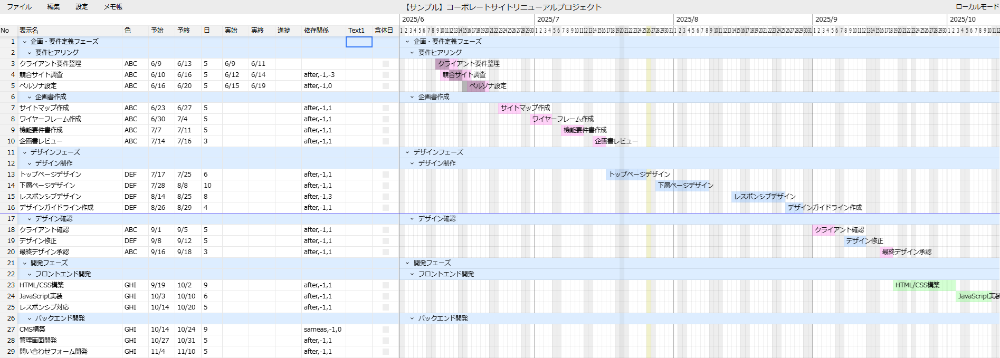

# Excelライクなガントチャート

[English](README.en.md) | 日本語

##  動作環境について

**PCのChromium系ブラウザ（Chrome/Edge）でのみ動作します。**

- Firefox/Safariでは動作しません（対応予定なし）
- スマホ等モバイル端末では使用できません（対応予定なし）
- あくまで自分で使いたいために作成したものですが、同じ悩みを持つ方には役立つのではと思い、公開してみました

## お試しページ

**[https://kloir-z.github.io/ganttapp-local/](https://kloir-z.github.io/ganttapp-local/)**

## スクリーンショット



## 制作の背景

Excelで条件付き書式と数式を組み合わせてガントチャートを作成していましたが、少し行数が増える（200行以上など）と更新が煩雑で、「間違ったExcelの使い方」の代表例のような感じがしてもやもやしていました。動作も重く、俯瞰性も悪い。

2023年にChatGPTが登場し、コード生成能力の高さを知って「ガントチャートアプリを作れるのでは？」と思ったのがきっかけで制作を始めました。

## 主な機能とポイント

### 表とチャートの完全連動
- 表を編集するとチャートが即座に反映
- チャートをドラッグすると表も自動更新
- **ダブルクリックでチャート作成**、**ドラッグで移動・調整**、**右クリックで削除**

### Excelライクな表操作
- セル編集、行の挿入・削除・コピー
- ドラッグによる行移動
- 階層構造でタスクをグループ化

### 依存関係の自動計算(afterとsameas)
- **`after,-x,n`**: x行前の完了後、n日後に開始
  - 例: `after,-1,3` → 1行前の3日後に開始日を設定
- **`sameas,-x`**: x行前と同時開始  
  - 例: `sameas,-1` → 1行前の開始日に合わせる
- 依存関係行のいずれかを変更するとリアルタイム連動

### 休日を考慮した自動調整
- 日付変更時に土日祝を自動回避（行単位で有効無効設定可能）
- カスタマイズ可能な休日設定（週末の曜日・色、祝日の色、独自休日）
- ※デフォルトで2022～2029年の日本の祝日が設定済み

### チャートの俯瞰性
- **チャートの各日の幅を0.5px単位で調整可能** - 長期間プロジェクトの俯瞰表示に対応
- 最大1000行のタスクを軽快に表示

### その他
- **取り消し・やり直し**: 最大30回の操作履歴を保持
- **多言語対応**: 日本語・英語に対応
- **日付形式設定**: yyyy/mm/dd、mm/dd/yyyy、dd/mm/yyyy形式から選択可能

## セットアップ

### 前提条件
- Node.js 16以上
- npm または yarn

### インストール手順

1. リポジトリをクローン:
```bash
git clone https://github.com/yourusername/gantt-local.git
cd gantt-local
```

2. 依存関係をインストール:
```bash
npm install
```

3. 開発サーバーを起動:
```bash
npm run dev
```

4. ブラウザで `http://localhost:5173` にアクセス

## 基本的な使い方

### 新規プロジェクトの作成
1. 「ファイル」→「新規作成」でプロジェクトを開始
2. WBS表でタスクを追加・編集
3. 依存関係列でタスク間の関係を設定
4. ガントチャートで期間を調整

### プロジェクトの保存・読み込み
- **保存**: 「ファイル」→「エクスポート」でZIPファイルに保存
- **読み込み**: 「ファイル」→「インポート」で保存済みファイルを開く

### メモの活用
1. 「メモ」ボタンでメモ画面を開く
2. 左側のツリーでタスクを選択
3. 右側のエディターでメモを記録

## ビルド・配布

### 通常のビルド
```bash
npm run build      # 本番用ビルド (dist/フォルダに出力)
```

### 開発用コマンド
```bash
npm run dev        # 開発サーバー起動
npm run lint       # コード品質チェック
npm run test       # テスト実行
npm run preview    # ビルド結果のプレビュー
```

## 技術構成

- **フロントエンド**: React 18 + TypeScript
- **状態管理**: Redux Toolkit  
- **ビルドツール**: Vite
- **UIライブラリ**: Material-UI, Ant Design
- **リッチテキスト**: Quill Editor
- **ファイル処理**: JSZip
- **テスト**: Jest + React Testing Library

## ライセンス

MIT License - 詳細は [LICENSE](LICENSE) ファイルを参照
